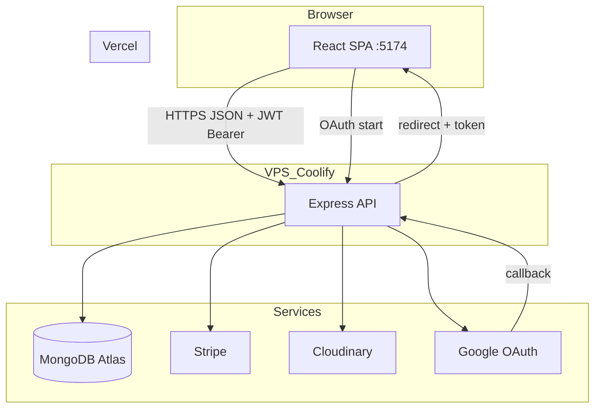
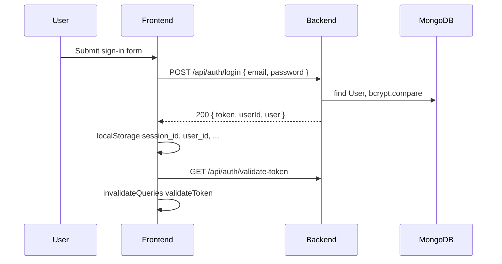

# Hotel Booking MERN — Project Walkthrough (A–Z)

One-document overview of architecture, code layout, API, routing, auth, data flow, and deployment.

**Live (production)**

| Service            | URL                                         |
| ------------------ | ------------------------------------------- |
| Frontend           | <https://hotel-mern-booking.vercel.app>     |
| Backend API        | <https://hotel-booking-backend.duckdns.org> |
| API docs (Swagger) | `{BACKEND_URL}/api-docs`                    |

**Local development**

| Service           | URL                                                        |
| ----------------- | ---------------------------------------------------------- |
| Frontend (Vite)   | <http://localhost:5174>                                    |
| Backend (Express) | <http://localhost:5001> (default; macOS often blocks 5000) |

---

## Table of contents

1. [What this project is](#1-what-this-project-is)
2. [Monorepo layout](#2-monorepo-layout)
3. [High-level architecture](#3-high-level-architecture)
4. [Tech stack](#4-tech-stack)
5. [Backend walkthrough](#5-backend-walkthrough)
6. [Frontend walkthrough](#6-frontend-walkthrough)
7. [Authentication (end-to-end)](#7-authentication-end-to-end)
8. [Core user journeys](#8-core-user-journeys)
9. [React Query & cache invalidation](#9-react-query--cache-invalidation)
10. [Shared types](#10-shared-types)
11. [Environment variables](#11-environment-variables)
12. [Deployment](#12-deployment)
13. [Testing](#13-testing)
14. [Local dev quickstart](#14-local-dev-quickstart)
15. [Related docs in `docs/`](#15-related-docs-in-docs)

---

## 1. What this project is

A full-stack **hotel booking platform**:

- Guests **search** hotels, view **details**, **book** rooms, pay with **Stripe**
- Owners **list / edit** hotels, upload images via **Cloudinary**, view **bookings**
- **Business insights** dashboard (aggregated metrics)
- **JWT** email/password auth + optional **Google OAuth**

Stack: **MongoDB** + **Express** API + **React (Vite)** SPA + **TypeScript** shared types.

---

## 2. Monorepo layout

```bash
hotel-booking-1/
├── hotel-booking-backend/     # Express API, Mongoose, Stripe, Cloudinary
├── hotel-booking-frontend/    # React SPA (Vite)
├── shared/                    # types.ts — used by frontend + backend
├── e2e-tests/                 # Playwright tests
├── data/                      # test-users.json, test-hotel.json (fixtures)
├── docs/                      # Guides + this walkthrough
└── README.md
```

| Package  | Entry file                            | Dev command                       |
| -------- | ------------------------------------- | --------------------------------- |
| Backend  | `hotel-booking-backend/src/index.ts`  | `npm run dev` (nodemon + ts-node) |
| Frontend | `hotel-booking-frontend/src/main.tsx` | `npm run dev` (Vite, port 5174)   |

---

## 3. High-level architecture



**Request path (typical API call)**

1. React component → `api-client.ts` function
2. Axios (`lib/api-client.ts`) adds `Authorization: Bearer <token>` from `localStorage.session_id`
3. Express route → optional `verifyToken` middleware → Mongoose → JSON response
4. React Query caches / invalidates by query key (e.g. `validateToken`)

---

## 4. Tech stack

| Layer    | Technologies                                                                                                 |
| -------- | ------------------------------------------------------------------------------------------------------------ |
| Frontend | React 18, TypeScript, Vite, React Router, React Query, Axios, Tailwind, shadcn/ui, Stripe Elements, Recharts |
| Backend  | Node.js, Express, TypeScript, Mongoose, JWT, bcrypt, multer, Swagger                                         |
| Data     | MongoDB                                                                                                      |
| Media    | Cloudinary                                                                                                   |
| Payments | Stripe PaymentIntents (GBP)                                                                                  |
| Auth     | JWT + Google OAuth 2.0                                                                                       |
| Deploy   | Vercel (frontend), Docker/Coolify (backend)                                                                  |

**No Python** in this repository.

---

## 5. Backend walkthrough

### 5.1 Boot sequence (`src/index.ts`)

1. Load `dotenv`
2. **Fail fast** if required env vars missing: `MONGODB_CONNECTION_STRING`, `JWT_SECRET_KEY`, Cloudinary ×3, `STRIPE_API_KEY`
3. Configure Cloudinary
4. Connect MongoDB (exit on failure)
5. Create Express app + middleware
6. Mount routes (see below)
7. Listen on `PORT` (default **5001**)

### 5.2 Global middleware

| Middleware                    | Purpose                                                                     |
| ----------------------------- | --------------------------------------------------------------------------- |
| `helmet`                      | Security headers                                                            |
| `trust proxy`                 | Rate limit behind reverse proxy (Coolify)                                   |
| `express-rate-limit`          | General `/api/*` + stricter payment routes                                  |
| `compression`                 | Response compression                                                        |
| `morgan`                      | HTTP logging                                                                |
| `cors`                        | Allows `FRONTEND_URL`, localhost:5174/5173, `*.vercel.app`, `*.netlify.app` |
| `cookieParser`                | Cookies (register + logout)                                                 |
| `express.json` / `urlencoded` | JSON bodies                                                                 |

### 5.3 Route mounts

| Prefix                   | File                          | Responsibility                                  |
| ------------------------ | ----------------------------- | ----------------------------------------------- |
| `/api/auth`              | `routes/auth.ts`              | Login, Google OAuth, validate, logout           |
| `/api/users`             | `routes/users.ts`             | Register, current user                          |
| `/api/hotels`            | `routes/hotels.ts`            | Public hotels, search, payment, confirm booking |
| `/api/my-hotels`         | `routes/my-hotels.ts`         | Owner CRUD + image upload                       |
| `/api/my-bookings`       | `routes/my-bookings.ts`       | Guest’s bookings                                |
| `/api/bookings`          | `routes/bookings.ts`          | Owner/admin booking management                  |
| `/api/health`            | `routes/health.ts`            | Health checks                                   |
| `/api/business-insights` | `routes/business-insights.ts` | Analytics aggregates                            |
| `/api-docs`              | `swagger.ts`                  | Interactive API documentation                   |

### 5.4 Auth middleware (`middleware/auth.ts`)

`verifyToken` reads JWT from:

1. `Authorization: Bearer <token>` (primary — frontend uses this), or
2. Cookie `session_id`

Attaches `req.userId` for downstream handlers. Returns **401** if missing/invalid.

### 5.5 Complete API reference

#### Auth — `/api/auth`

| Method | Path               | Auth | Description                                                       |
| ------ | ------------------ | ---- | ----------------------------------------------------------------- |
| GET    | `/google`          | —    | Redirect to Google OAuth                                          |
| GET    | `/callback/google` | —    | OAuth callback; create/find user; redirect to frontend with token |
| POST   | `/login`           | —    | Email/password → JWT in JSON body                                 |
| GET    | `/validate-token`  | JWT  | Returns `{ userId }`                                              |
| POST   | `/logout`          | —    | Clears `session_id` cookie                                        |

#### Users — `/api/users`

| Method | Path        | Auth | Description                                    |
| ------ | ----------- | ---- | ---------------------------------------------- |
| POST   | `/register` | —    | Create user; sets httpOnly `auth_token` cookie |
| GET    | `/me`       | JWT  | Current user profile                           |

#### Hotels (public + booking) — `/api/hotels`

| Method | Path                                | Auth | Description                            |
| ------ | ----------------------------------- | ---- | -------------------------------------- |
| GET    | `/`                                 | —    | All hotels                             |
| GET    | `/search`                           | —    | Filtered search + pagination           |
| GET    | `/:id`                              | —    | Hotel by ID                            |
| POST   | `/:hotelId/bookings/payment-intent` | JWT  | Stripe PaymentIntent                   |
| POST   | `/:hotelId/bookings`                | JWT  | Create booking after payment succeeded |

**Search query params:** `destination`, `adultCount`, `childCount`, `facilities[]`, `types[]`, `stars[]`, `maxPrice`, `sortOption`, `page` (page size 5).

#### My hotels (owner) — `/api/my-hotels`

| Method | Path        | Auth | Description                                |
| ------ | ----------- | ---- | ------------------------------------------ |
| POST   | `/`         | JWT  | Create hotel + up to 6 images (Cloudinary) |
| GET    | `/`         | JWT  | List owner’s hotels                        |
| GET    | `/:id`      | JWT  | One hotel (owner)                          |
| PUT    | `/:hotelId` | JWT  | Update hotel + optional new images         |

#### My bookings (guest) — `/api/my-bookings`

| Method | Path | Auth | Description                     |
| ------ | ---- | ---- | ------------------------------- |
| GET    | `/`  | JWT  | User bookings (hotel populated) |

#### Bookings management — `/api/bookings`

| Method | Path              | Auth | Description                            |
| ------ | ----------------- | ---- | -------------------------------------- |
| GET    | `/`               | JWT  | All bookings                           |
| GET    | `/hotel/:hotelId` | JWT  | Bookings for one hotel (owner)         |
| GET    | `/:id`            | JWT  | Booking by ID                          |
| PATCH  | `/:id/status`     | JWT  | Update booking status                  |
| PATCH  | `/:id/payment`    | JWT  | Update payment status                  |
| DELETE | `/:id`            | JWT  | Delete booking; adjust hotel analytics |

#### Health — `/api/health`

| Method | Path        | Description           |
| ------ | ----------- | --------------------- |
| GET    | `/`         | DB + memory status    |
| GET    | `/detailed` | Extended system stats |

#### Business insights — `/api/business-insights`

| Method | Path                   | Auth | Description              |
| ------ | ---------------------- | ---- | ------------------------ |
| GET    | `/dashboard/public`    | —    | Public dashboard metrics |
| GET    | `/dashboard`           | JWT  | Same (authenticated)     |
| GET    | `/forecast/public`     | —    | Forecast data            |
| GET    | `/forecast`            | JWT  | Forecast (auth)          |
| GET    | `/system-stats/public` | —    | System/performance stats |
| GET    | `/system-stats`        | JWT  | System stats (auth)      |

> **Note:** `Review` and `Analytics` Mongoose models exist but have **no REST routes** yet. Insights are computed live from `Hotel`, `User`, and `Booking` collections.

### 5.6 Data models (MongoDB / Mongoose)

| Model         | File                  | Key fields                                                                                                                                                                      |
| ------------- | --------------------- | ------------------------------------------------------------------------------------------------------------------------------------------------------------------------------- |
| **User**      | `models/user.ts`      | `email`, `password` (bcrypt pre-save), `firstName`, `lastName`, `image`, `role`, `totalBookings`, `totalSpent`                                                                  |
| **Hotel**     | `models/hotel.ts`     | `userId`, `name`, `city`, `country`, `type[]`, `facilities[]`, `pricePerNight`, `starRating`, `imageUrls[]`, `location`, `contact`, `policies`, `totalBookings`, `totalRevenue` |
| **Booking**   | `models/booking.ts`   | `userId`, `hotelId`, guest info, `checkIn`/`checkOut`, `totalCost`, `status`, `paymentStatus`                                                                                   |
| **Review**    | `models/review.ts`    | Schema only (future)                                                                                                                                                            |
| **Analytics** | `models/analytics.ts` | Schema only (future)                                                                                                                                                            |

Bookings live in a **separate collection** (not embedded in `Hotel`).

### 5.7 Stripe flow (`routes/hotels.ts`)

1. **PaymentIntent:** `POST /api/hotels/:hotelId/bookings/payment-intent`  
   Amount = `pricePerNight × nights × 100` (pence), `currency: gbp`, metadata `{ hotelId, userId }`.
2. **Confirm booking:** `POST /api/hotels/:hotelId/bookings`  
   Retrieves PaymentIntent; requires `status === "succeeded"`; creates `Booking`; updates hotel/user totals.

### 5.8 Cloudinary (`routes/my-hotels.ts`)

- Multer memory storage (max 6 files, 5MB each on create)
- Upload to Cloudinary with resize/quality transforms
- Store returned URLs in `hotel.imageUrls`

---

## 6. Frontend walkthrough

### 6.1 Bootstrap (`src/main.tsx`)

```text
QueryClientProvider
  └── AppContextProvider      (auth, Stripe, global loading, toasts)
        └── SearchContextProvider   (search criteria → sessionStorage)
              └── App (React Router)
```

- **React Query** `queryClient`: default `retry: 0` on queries
- Exported `queryClient` for invalidation from `api-client.ts`

### 6.2 Routing (`src/App.tsx`)

| Path                      | Page                 | Layout       | Access                               |
| ------------------------- | -------------------- | ------------ | ------------------------------------ |
| `/`                       | `Home`               | `Layout`     | Public                               |
| `/search`                 | `Search`             | `Layout`     | Public                               |
| `/detail/:hotelId`        | `Detail`             | `Layout`     | Public                               |
| `/api-docs`               | `ApiDocs`            | `Layout`     | Public                               |
| `/api-status`             | `ApiStatus`          | `Layout`     | Public                               |
| `/business-insights`      | `AnalyticsDashboard` | `Layout`     | Public                               |
| `/register`               | `Register`           | `AuthLayout` | Public                               |
| `/sign-in`                | `SignIn`             | `AuthLayout` | Public                               |
| `/auth/callback`          | `AuthCallback`       | `Layout`     | OAuth return                         |
| `/my-hotels`              | `MyHotels`           | `Layout`     | Public route; API needs JWT for data |
| `/my-bookings`            | `MyBookings`         | `Layout`     | Public route; API needs JWT          |
| `/hotel/:hotelId/booking` | `Booking`            | `Layout`     | **Only if `isLoggedIn`**             |
| `/add-hotel`              | `AddHotel`           | `Layout`     | **Only if `isLoggedIn`**             |
| `/edit-hotel/:hotelId`    | `EditHotel`          | `Layout`     | **Only if `isLoggedIn`**             |
| `*`                       | → redirect `/`       |              |                                      |

**Layouts**

- `layouts/Layout.tsx` — main chrome (header, nav, footer)
- `layouts/AuthLayout.tsx` — centered auth pages

> UI hides some routes when logged out; **backend still enforces JWT** on protected mutations.

### 6.3 API client layers

| File                | Role                                                                       |
| ------------------- | -------------------------------------------------------------------------- |
| `lib/api-client.ts` | Axios instance, `getApiBaseUrl()`, JWT interceptor, 401 cleanup, 429 retry |
| `api-client.ts`     | Named API functions (hotels, auth, bookings, insights, etc.)               |

**Base URL resolution** (`getApiBaseUrl`):

1. `import.meta.env.VITE_API_BASE_URL` if set
2. Else Vercel/Netlify host → `https://hotel-booking-backend.duckdns.org`
3. Else `localhost` → `http://localhost:5001`
4. Else production duckdns default

### 6.4 Contexts

| Context           | File                         | Stores                                                                                                 |
| ----------------- | ---------------------------- | ------------------------------------------------------------------------------------------------------ |
| **AppContext**    | `contexts/AppContext.tsx`    | `isLoggedIn` (from `validateToken` query + localStorage fallback), Stripe, global loading, `showToast` |
| **SearchContext** | `contexts/SearchContext.tsx` | destination, dates, guest counts, `hotelId` → `sessionStorage`                                         |

Hooks: `useAppContext`, `useSearchContext`, `useLoadingHooks` (`useQueryWithLoading`, `useMutationWithLoading`).

### 6.5 Key pages & components

| Area           | Files                                                                           |
| -------------- | ------------------------------------------------------------------------------- |
| Home           | `pages/Home.tsx` — featured hotels                                              |
| Search         | `pages/Search.tsx`, `SearchBar`, `AdvancedSearch`, filters                      |
| Detail         | `pages/Detail.tsx`                                                              |
| Booking        | `pages/Booking.tsx`, `forms/BookingForm/`                                       |
| Owner          | `pages/MyHotels.tsx`, `AddHotel.tsx`, `EditHotel.tsx`, `forms/ManageHotelForm/` |
| Guest bookings | `pages/MyBookings.tsx`                                                          |
| Analytics      | `pages/AnalyticsDashboard.tsx`                                                  |
| Auth           | `pages/SignIn.tsx`, `Register.tsx`, `AuthCallback.tsx`                          |
| Nav            | `components/MainNav.tsx`, `SignOutButton.tsx`                                   |

---

## 7. Authentication (end-to-end)

### 7.1 Email / password login



**Storage (frontend):** `localStorage.session_id` (JWT), `user_id`, `user_email`, `user_name`.

### 7.2 Registration

1. `POST /api/users/register` — hashed password (User pre-save hook)
2. Backend may set httpOnly cookie `auth_token`
3. Frontend invalidates `validateToken` (same pattern as login)

### 7.3 Google OAuth

1. User clicks **Continue with Google** → `window.location = {API}/api/auth/google`
2. Backend redirects to Google with  
   `redirect_uri = {BACKEND_URL}/api/auth/callback/google`
3. Google → backend callback with `code`
4. Backend: token exchange → userinfo → find/create `User` → JWT
5. Redirect: `{FRONTEND_URL}/auth/callback?token&userId&email&...`
6. `AuthCallback.tsx` writes `localStorage` → `invalidateQueries("validateToken")` → navigate `/`

**Google Console:** must register exact callback URL per environment (see `.env.local.example`).

### 7.4 Logout

- `POST /api/auth/logout` clears cookie
- `SignOutButton` clears `localStorage` + invalidates `validateToken`

### 7.5 Protected API calls

Axios request interceptor (`lib/api-client.ts`):

```text
Authorization: Bearer ${localStorage.getItem("session_id")}
```

---

## 8. Core user journeys

### 8.1 Search → detail

1. `SearchBar` / `AdvancedSearch` → `SearchContext.saveSearchValues()` → navigate `/search`
2. `Search.tsx` → `searchHotels()` → `GET /api/hotels/search?...`
3. Filters: price, stars, types, facilities; pagination
4. Card click → `/detail/:hotelId` → `GET /api/hotels/:id`

### 8.2 Book & pay

1. Detail → book → `/hotel/:hotelId/booking` (requires login in UI)
2. `Booking.tsx`: nights from `SearchContext` dates
3. `createPaymentIntent` → Stripe `clientSecret`
4. `BookingForm`: `stripe.confirmCardPayment` → on success → `POST /api/hotels/:id/bookings`
5. Redirect `/my-bookings`

### 8.3 Owner: manage hotels

1. `/add-hotel` or `/edit-hotel/:id`
2. `ManageHotelForm` (multipart): details, types, guests, facilities, images, contact, policies
3. `POST /api/my-hotels` or `PUT /api/my-hotels/:hotelId`
4. `MyHotels.tsx` lists properties; `BookingLogModal` → `GET /api/bookings/hotel/:hotelId`

### 8.4 Business insights

`/business-insights` → `AnalyticsDashboard` → public insight endpoints + Recharts charts.

---

## 9. React Query & cache invalidation

| Query key         | Where                | Fetches                        |
| ----------------- | -------------------- | ------------------------------ |
| `validateToken`   | `AppContext`         | `GET /api/auth/validate-token` |
| `fetchQuery`      | `Home`               | all hotels                     |
| dynamic           | `Search`             | search results                 |
| `fetchHotelByID`  | `Detail`, `Booking`  | one hotel                      |
| `fetchMyBookings` | `MyBookings`         | guest bookings                 |
| `fetchMyHotels`   | `MyHotels`           | owner hotels                   |
| hotel id          | `EditHotel`          | owner hotel                    |
| insight keys      | `AnalyticsDashboard` | business-insights              |
| health            | `ApiStatus`          | `/api/health`                  |

**Invalidation / refetch on auth change**

| Action       | File                | Effect                                                 |
| ------------ | ------------------- | ------------------------------------------------------ |
| Sign in      | `api-client.signIn` | `invalidateQueries` + `refetchQueries` `validateToken` |
| Register     | `Register.tsx`      | `invalidateQueries("validateToken")`                   |
| Google OAuth | `AuthCallback.tsx`  | `invalidateQueries("validateToken")`                   |
| Sign out     | `SignOutButton.tsx` | `invalidateQueries("validateToken")`                   |

`AppContext` derives `isLoggedIn` from `validateToken` success + optional localStorage JWT fallback.

**Stale time:** `validateToken` uses 5 minutes; `refetchOnWindowFocus: false`.

---

## 10. Shared types

**File:** `shared/types.ts`

Used by frontend imports (`../../shared/types`) and backend build (Docker copies `shared/`).

Main exports: `UserType`, `HotelType`, `BookingType`, `HotelWithBookingsType`, `HotelSearchResponse`, `PaymentIntentResponse`.

Keeps API response shapes aligned between client and server.

---

## 11. Environment variables

### Backend (`hotel-booking-backend/.env`)

| Variable                     | Required         | Purpose                   |
| ---------------------------- | ---------------- | ------------------------- |
| `MONGODB_CONNECTION_STRING`  | Yes              | MongoDB                   |
| `JWT_SECRET_KEY`             | Yes              | Sign/verify JWT           |
| `CLOUDINARY_*` (3)           | Yes              | Image uploads             |
| `STRIPE_API_KEY`             | Yes              | Stripe secret             |
| `PORT`                       | No               | Default **5001**          |
| `FRONTEND_URL`               | Recommended      | CORS + OAuth redirects    |
| `BACKEND_URL`                | No               | OAuth `redirect_uri` base |
| `GOOGLE_ID`, `GOOGLE_SECRET` | For Google login | OAuth                     |

Template: `.env.example`, `.env.local.example`

### Frontend (`hotel-booking-frontend/.env` / `.env.local`)

| Variable              | Purpose                               |
| --------------------- | ------------------------------------- |
| `VITE_API_BASE_URL`   | Backend origin (must match `PORT`)    |
| `VITE_STRIPE_PUB_KEY` | Stripe publishable key (`AppContext`) |

Template: `.env.local.example`

**Production:** set in **Vercel** and **Coolify** dashboards — not committed to Git.

---

## 12. Deployment

### Frontend — Vercel

- **Config:** `hotel-booking-frontend/vercel.json`
- Build: `npm run build` → `dist/`
- SPA rewrite: all routes → `index.html`
- Env: `VITE_API_BASE_URL=https://hotel-booking-backend.duckdns.org`

### Backend — Docker / Coolify

- **Dockerfile:** `hotel-booking-backend/Dockerfile` (build from repo root — includes `shared/`)
- Runtime: `node dist/hotel-booking-backend/src/index.js`
- Set `PORT` in Coolify (e.g. 3000); map host port as needed
- Health: `GET /api/health`

### CORS

Backend allows production frontends (`vercel.app`, `netlify.app`) and `FRONTEND_URL` from env.

---

## 13. Testing

**E2E:** `e2e-tests/` (Playwright)

| Spec                          | Covers            |
| ----------------------------- | ----------------- |
| `tests/auth.spec.ts`          | Sign-in, register |
| `tests/search-hotels.spec.ts` | Search flow       |
| `tests/manage-hotels.spec.ts` | Add hotel         |

- Target UI: `http://localhost:5174`
- Requires backend + frontend running manually
- Fixtures: `data/test-users.json`, `data/test-hotel.json`

**Build verification**

```bash
cd hotel-booking-backend && npm run build
cd hotel-booking-frontend && npm run build
cd hotel-booking-frontend && npm run lint
```

---

## 14. Local dev quickstart

```bash
# Terminal 1
cd hotel-booking-backend
npm install
cp .env.example .env   # fill secrets
npm run dev            # → http://localhost:5001

# Terminal 2
cd hotel-booking-frontend
npm install
cp .env.local.example .env.local
npm run dev            # → http://localhost:5174
```

**Checklist**

| Item                              | Value                                            |
| --------------------------------- | ------------------------------------------------ |
| Backend `PORT`                    | `5001` (avoid macOS AirPlay on 5000)             |
| `VITE_API_BASE_URL`               | `http://localhost:5001`                          |
| `FRONTEND_URL`                    | `http://localhost:5174`                          |
| Google redirect (if using Google) | `http://localhost:5001/api/auth/callback/google` |

---

## 15. Related docs in `docs/`

| File                                          | Topic                               |
| --------------------------------------------- | ----------------------------------- |
| `../README.md`                                | Educational project README          |
| `../SECURITY.md`                              | Private vulnerability reporting     |
| `../CLAUDE.md` / `../AGENTS.md`               | Agent / Agile V session memory      |
| `AUTH_UI_IMPLEMENTATION_GUIDE.md`             | Auth UI patterns                    |
| `CLERK_AUTH_COMPLETE_IMPLEMENTATION_GUIDE.md` | Clerk migration (not current stack) |
| `DROPDOWN_TEST_CREDENTIALS_DOCS.md`           | Test credentials                    |

**Deploy note (2026-07):** README Deployment = Optional Diploi launch → Coolify backend → Vercel/Netlify frontend. Production demos remain Coolify + Vercel.

**Env note:** Frontend Stripe pub key env is `VITE_STRIPE_PUB_KEY` (see `AppContext`). Backend still fail-fast on required secrets.

---

## Quick reference — file map

```bash
Backend
  src/index.ts           → app entry, middleware, route mounts
  src/routes/*.ts        → API handlers
  src/middleware/auth.ts → JWT verification
  src/models/*.ts        → Mongoose schemas
  src/swagger.ts         → OpenAPI spec

Frontend
  src/main.tsx           → providers
  src/App.tsx            → routes
  src/api-client.ts      → API functions
  src/lib/api-client.ts  → Axios + base URL
  src/contexts/*.tsx     → global state
  src/pages/*.tsx        → screens
  src/forms/**           → booking + hotel forms
  src/components/**      → UI building blocks

Shared
  shared/types.ts        → TypeScript contracts
```

---

_Last aligned with codebase: local backend port **5001**, frontend **5174**, JWT in `localStorage`, production URLs on Vercel + Coolify; README/SECURITY/Diploi optional deploy (2026-07)._
